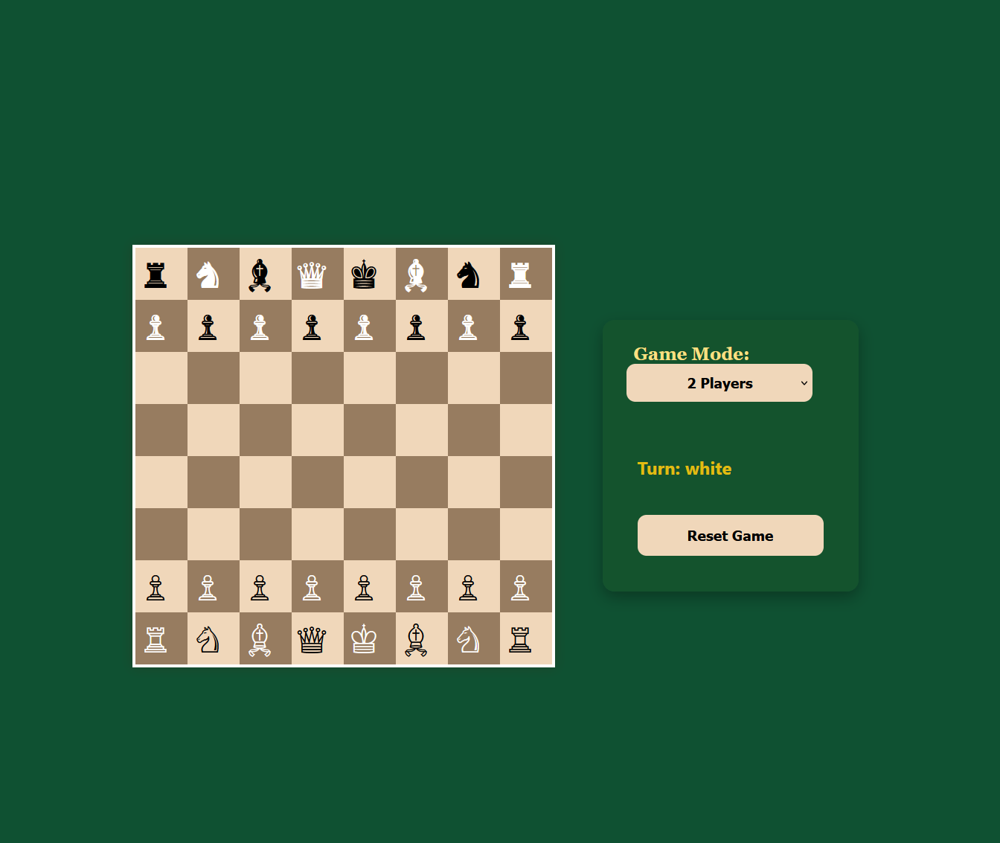

♟️ React Chess Game

A simple, lightweight frontend‑only chess game built with React, featuring Two‑Player Mode and Play Against Computer Mode.
Designed as a fun project to explore board rendering, state management, and interactive UI behaviour.
✨ Features
👥 Two‑Player Mode

    Local multiplayer

    Players take turns on the same board

    Basic move validation

    Highlights selected pieces and available moves

🤖 Play Against Computer

    Simple computer opponent

    Makes basic legal moves

    Ideal for casual solo play

♟️ Core Chess Functionality

    Piece movement rules

    Turn switching

    Basic check/checkmate detection (if included — or remove this line)

    Pawn promotion (if included — or remove this line)

(If your game doesn’t include advanced rules like castling or en passant, you can remove those from the list. Keeping it honest is totally fine.)
🧱 Tech Stack
Frontend

    React

    React Hooks

    CSS Modules / Styled Components (adjust to your project)

Architecture

    Board rendered as an 8×8 grid

    Game state stored in React state

    Move logic handled in helper functions

📦 Installation & Setup
bash

# Clone the repo
git clone https://github.com/your-username/react-chess-game.git

# Install dependencies
npm install

# Start the development server
npm start

🎮 How to Play
Two‑Player Mode

    Select 2 Player from the menu

    White moves first

    Players alternate turns

Play Against Computer

    Select Computer Mode

    Make your move — the computer responds with a basic legal move

🚀 Future Improvements

    Stronger AI (minimax, alpha‑beta pruning)

    Move history

    Undo/redo

    Online multiplayer

    Themes (dark mode, wood textures)

    ## 📸 Screenshots

### Homepage

